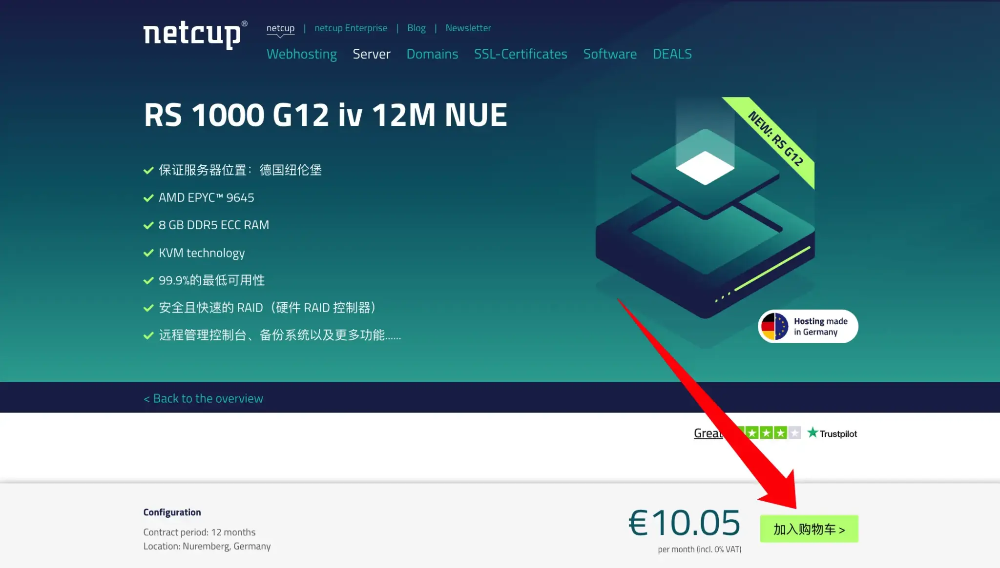
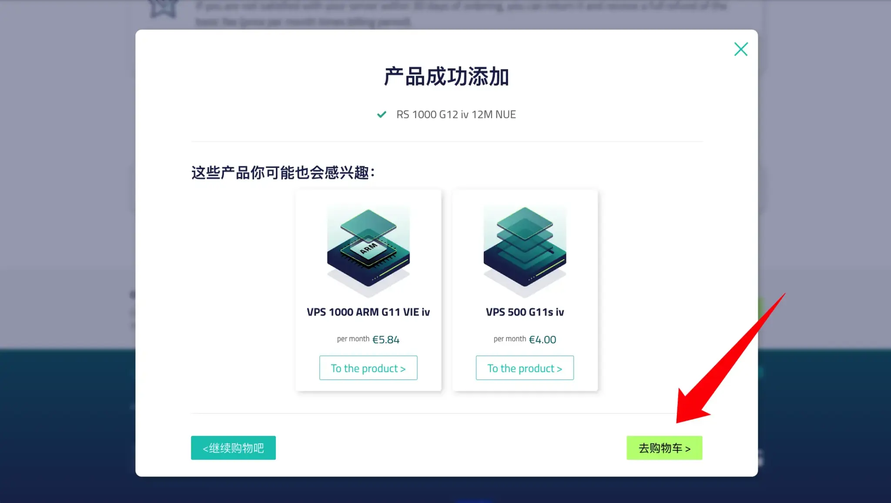
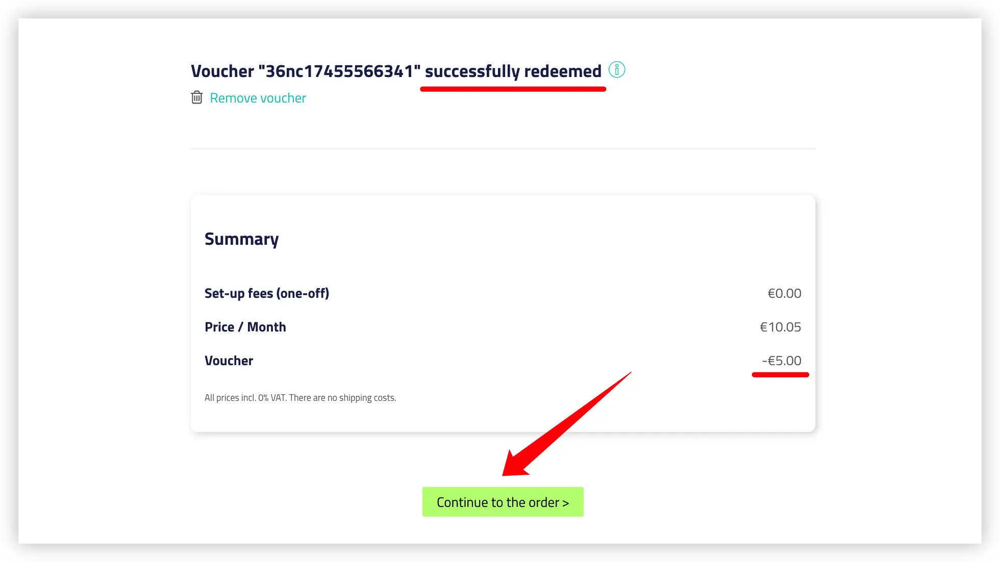

# Netcup 2025年最新优惠码大全 - 新人立减5欧 & VPS/RS服务器年付特惠 🚀

本文汇集了 Netcup 2025年12月最新可用的优惠码。涵盖**新人首购福利**、**VPS系列**以及**RS高性能独服系列**。所有代码每日人工核验，确保真实有效。

---

## 🎁 第一类：新人首购专享 (首单立减 €5 欧元)

适用于新用户注册后首次下单，无门槛直接减免 5 欧元。

| 优惠券代码 (点击复制) | 优惠详情 | 适用范围 | 状态 |
| :--- | :--- | :--- | :---: |
| `36nc17355236430` | **立减 €5** | 全场通用/首单 | ✅ 待领取 |
| `36nc17355236431` | **立减 €5** | 全场通用/首单 | ✅ 待领取 |
| `36nc17355236432` | **立减 €5** | 全场通用/首单 | ✅ 待领取 |
| `36nc17355236434` | **立减 €5** | 全场通用/首单 | ✅ 待领取 |
| `36nc17355236435` | **立减 €5** | 全场通用/首单 | ✅ 待领取 |
| `36nc17355236436` | **立减 €5** | 全场通用/首单 | ✅ 待领取 |
| `36nc17355236437` | **立减 €5** | 全场通用/首单 | ✅ 待领取 |
| `36nc17355236438` | **立减 €5** | 全场通用/首单 | ✅ 待领取 |
| `36nc17355236439` | **立减 €5** | 全场通用/首单 | ✅ 待领取 |
| `36nc17451444820` | **立减 €5** | 全场通用/首单 | ✅ 待领取 |

> 💡 **提示**：每个新账号仅限使用一次，如果提示已被使用，请尝试列表中的下一个。

---

## ☁️ 第二类：VPS 系列优惠码 (最高免2个月)

性价比之选，适合建站、学习及轻量应用。
*   **全系福利**：年付均可 **免费使用 1个月** (实付11个月费用)。

| 型号 (Model) | 优惠码 (任选其一) | 优惠力度 |
| :--- | :--- | :--- |
| **VPS 1000** | `4095nc17656718450` `4095nc17656718451` `4095nc17656718452` `4095nc17656718453` | 年付免1个月 |
| **VPS 2000** | `4101nc17656719120` `4101nc17656719121` `4101nc17656719122` `4101nc17656719123` | 年付免1个月 |
| **VPS 3000** | `4102nc17656753700` `4102nc17656753701` `4102nc17656753702` `4102nc17656753703` | 年付免1个月 |
| **VPS 4000** | `4103nc17656754080` `4103nc17656754081` `4103nc17656754082` `4103nc17656754083` | 年付免1个月 |
| **VPS 6000** | `4104nc17656754450` `4104nc17656754451` `4104nc17656754452` `4104nc17656754453` | 年付免1个月 |
| **VPS 8000** | `4105nc17656754800` `4105nc17656754801` `4105nc17656754802` `4105nc17656754803` | 年付免1个月 |

---

## ⚡ 第三类：RS 系列独立服务器 (高性能年付优惠)

适合大型应用、独享资源需求。
*   **VPS 1000**：年付 **免费送 2个月** (买12个月只需付10个月) 🔥
*   **VPS 2000及以上**：年付 **免费送 1个月** (买12个月只需付11个月)

| 型号 (Model) | 优惠码 (任选其一) | 优惠力度 |
| :--- | :--- | :--- |
| **RS 1000** | `5159nc17641203850` `5159nc17641203851` `5159nc17641203852` `5159nc17641203853` |  **年付免2个月**   (超值推荐) |
| **RS 2000** | `5160nc17656756240` `5160nc17656756241` `5160nc17656756242` `5160nc17656756243` | **年付免1个月** |
| **RS 4000** | `5161nc17656756580` `5161nc17656756581` `5161nc17656756582` `5161nc17656756583` | **年付免1个月** |
| **RS 8000** | `5162nc17656756900` `5162nc17656756901` `5162nc17656756902` `5162nc17656756903` | **年付免1个月** |

---

## 📝 如何使用优惠码？
1. 将准备下单的服务器加入购物车。

2. 点击 [结算页面](https://www.netcup.com/en/checkout/cart)，准备输入优惠码。

3. 在结账页面（Checkout）找到 **"Redeem Coupon"** 或 **"Voucher"** 输入框。

4. 粘贴代码并点击确认，价格将自动更新。

---

## ❓ 常见问题解答 (FAQ) - 关于 Netcup 注册与优惠

这里整理了用户在使用 Netcup 优惠码及注册过程中最常遇到的问题。

### 💰 优惠码使用相关

**Q1: 新人 5 欧元优惠码和免月费优惠码可以叠加使用吗？**

通常情况下，Netcup 的购物车一次只能输入一个优惠码。
*   如果您购买的是**月付**产品，建议使用 **5欧元新人码**。
*   如果您购买的是**年付**产品（如 VPS 1000 年付），使用 **免2个月/免1个月** 的优惠码通常更划算。
*   *建议：在结账页面尝试输入不同代码，看哪个最终减免金额更多。*

**Q2: 为什么输入优惠码后提示 "Voucher not found" 或无效？**

请检查以下几点：
1.  **新人码限制**：5欧元优惠码仅限新注册且从未下过单的账号使用。如果您之前买过产品，该码将失效。
2.  **产品对应**：RS 系列的优惠码不能用于 VPS 系列，反之亦然。请确保您选购的型号与优惠码匹配。
3.  **空格问题**：复制时请注意不要带入前后的空格。

### 🔐 注册与身份验证 (重要)

**Q3: 注册 Netcup 需要身份证验证吗？(KYC 验证)**

非必须。对于非欧盟地区（如中国）的用户，Netcup 风控较严。
*   在之前，注册 Netcup 需要护照照片（或身份证带英文翻译）+ 英文账单地址证明（如水电单或信用卡账单）。2025年初取消了必须身份验证的步骤，可以使用支付方式进行验证。可参考 📖 推荐阅读
👉 [2025 如何注册 Netcup 免税账号保姆级教程](https://netcupzw.com/2024-how-to-register-netcup-tax-free-account-beginners-guide/)

**Q4: 中国用户可以申请免税 (VAT Exemption) 吗？**

可以！这是 Netcup 的一大优势。
*   默认价格含 19% 德国增值税。
*   作为中国用户，在通过身份验证后，系统通常会自动去除这 19% 的税费，相当于在优惠码的基础上**再打 84 折**！
*   *注意：最终价格以结账页面为准。*

### 💳 支付与售后

**Q5: 支持支付宝 (Alipay) 或微信支付吗？**

目前 Netcup **不支持** 支付宝或微信。
您需要使用 **PayPal**（建议首选，风控概率低）或 **Visa/Mastercard 信用卡** 进行支付。

**Q6: 购买后不满意可以退款吗？**

Netcup 提供 **31天满意度保证 (31 Days Satisfaction Guarantee)**。
如果您在购买后 31 天内不满意，可以申请全额退款。这让您可以放心试用 VPS 或 RS 独服的性能。

**Q7: RS 系列和 VPS 系列有什么区别？我该选哪个？**

*   **VPS 系列**：共享 CPU 核心，性价比极高，适合搭建博客、VPN、轻量级应用。
*   **RS 系列 (Root Server)**：提供**独享 CPU 核心**和专用资源，性能极其强悍，适合跑大流量业务、游戏服务器或高负载项目。

---
*如有其他问题，欢迎提交 Issue 反馈。祝您使用愉快！*

*最后更新时间：2025年12月14日*
